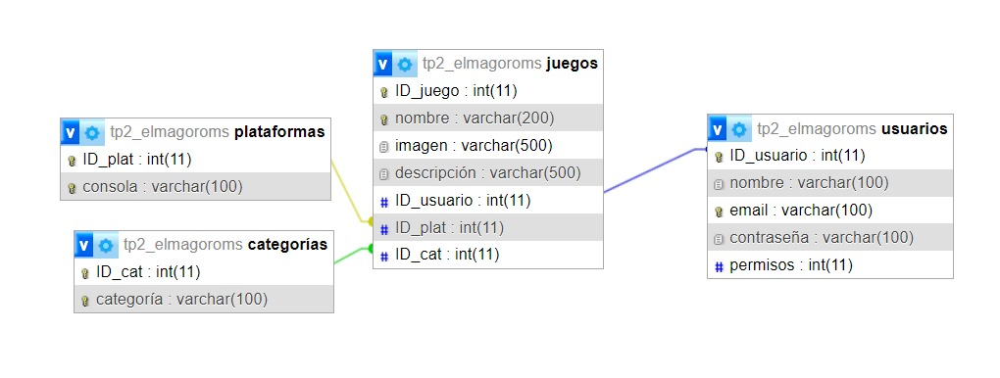

# web2_ElMaGoRoms - Entrega API Rest

## Descripción
Este proyecto consiste en una página web donde los usuarios pueden descargar ROMs para jugar videojuegos de otras plataformas en su PC. La base de datos almacena información sobre los juegos, plataformas, categorías y usuarios que pueden publicar sus propios ROMs.



---

## Explicaciones de EndPoints

### Listar todos los juegos (GET)
Genera un listado simple de todos los objetos a la vez.

**URL a utilizar:**
---> http://localhost/web2_ElMaGoRoms_api-main/api/juegos

---

### Listar en orden alfabético según el nombre (GET)
Ordena el listado general en forma alfabética, según si es descendente o ascendente.

**URLs a utilizar:**

- Ascendente:
  ---> http://localhost/web2_ElMaGoRoms_api-main/api/juegos/asc
  
- Descendente:  
  ---> http://localhost/web2_ElMaGoRoms_api-main/api/juegos/desc

---

### Buscar un juego específico (GET)
Busca un juego particular según la ID del mismo.

**URL a utilizar:**

---> http://localhost/web2_ElMaGoRoms_api-main/api/juego/"ID de un juego"

---

### Modificar un objeto específico (PUT)
Modifica un juego particular según la ID del mismo.

**URL a utilizar:**

---> http://localhost/web2_ElMaGoRoms_api-main/api/juego/"ID de un juego"

**Ejemplo de estructura para armar una modificación:**

```json
{
  "nombre": "-nombre del juego-",
  "imagen": "-imagen HTML del juego-",
  "descripción": "-descripción general del juego-",
  "plataforma": "-plataforma a ingresar-",
  "categoria": "-categoría a ingresar-"
}

```

### Crear un juego (POST)
Crea un nuevo juego.

**URL a utilizar:**

---> http://localhost/web2_ElMaGoRoms_api-main/api/juego

**Ejemplo de estructura para crear un juego:**

```json
{
  "nombre": "Pokemon Platino",
  "descripción": "Juego clásico de la Nintendo DS, el culmen de la 4ta generación de Pokémon.",
  "imagen": "imagen HTML de Pokémon Platino",
  "usuario": "APICreator",
  "plataforma": "Nintendo DS",
  "categoria": "Aventura"
}

```

## Notas a tener en cuenta:

- Para poder crear y modificar, los codigos de plataforma y categoria deben ser exactos tal cual lo que aparece en la base de datos, cualquier cambio, incluso cambiar una mayuscula, resultara en el codigo fallando

- Lo mismo no sucede en el crear usuarios, por otra parte, el codigo permite que se cree un usuario nuevo, pero requiere que se ingrese la data del juego a crear de nuevo una vez se crea el usuario

# Autores
Este proyecto fue realizado por Matías Morcillo (matiasmorcillo128@gmail.com) y Iago Medina Durán (iagomduran@gmail.com).
